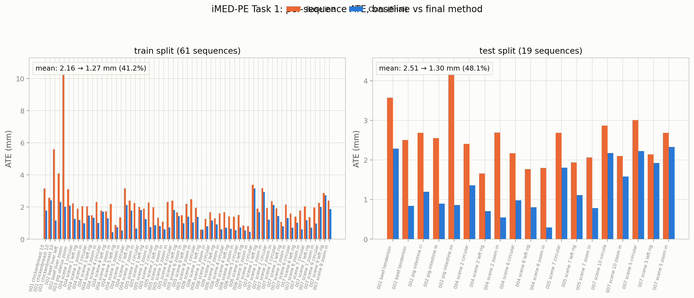
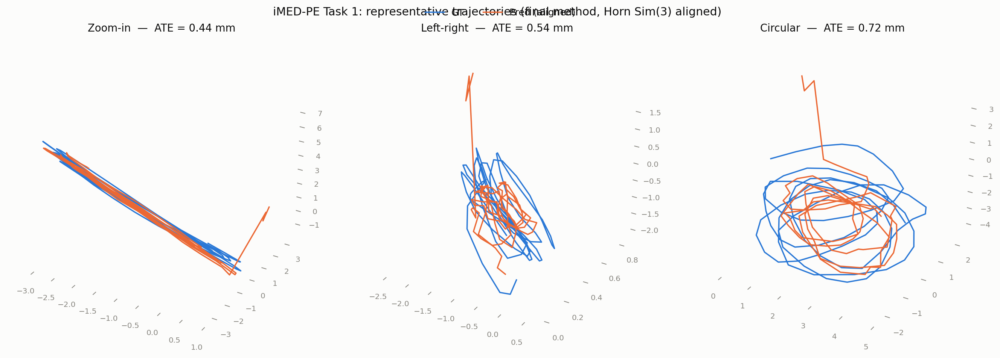
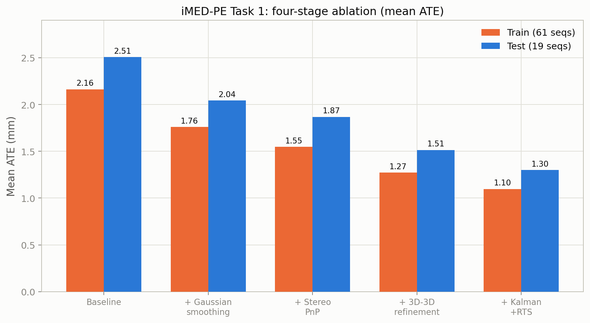

# Method Description — iMED-PE Task 1 (Pose Estimation)

## 1. Task Overview

Given synchronized stereo streams from two rigid endoscopes (endoscope1: L/R, endoscope2: L/R), estimate the same-time cross-camera relative pose of endoscope2/L with respect to endoscope1/L for every frame, as frame-to-initial transforms with frame 0 at identity. Translation is scale-ambiguous; scoring uses ATE RMSE after Sim(3) alignment plus the percentage of registered frames.

## 2. Method

Our submission builds on the official baseline (ALIKED keypoints + LightGlue matching + essential matrix) with four additions: **(a) stereo triangulation with PnP pose estimation**, **(b) 3D-3D refinement against the second endoscope's stereo depth**, **(c) constant-velocity Kalman + RTS temporal smoothing**, and quality gates throughout.

### 2.1 Stereo Triangulation + PnP (metric-consistent scale)

The pure essential-matrix baseline estimates each frame independently from two views (e1/L, e2/L), which has two weaknesses: per-frame scale ambiguity (the recovered translation is unit-norm, so the scale drifts across frames) and instability of E decomposition.

We exploit the rigid stereo pair of endoscope 1:

1. **Stereo extrinsics estimation.** The relative transform [R_st | t_st] between e1/L and e1/R is constant across the sequence. We estimate E matrices from stereo correspondences on 15 evenly sampled frames and aggregate the rotations (sign-aligned quaternion mean) and translation directions (unit-vector mean) into one fixed baseline.
2. **Triangulation.** For every frame, stereo matches are triangulated with the fixed extrinsics into 3D points in the e1/L camera frame, keeping only points with positive depth in both cameras. Because the baseline is fixed, all 3D points share one metric-consistent scale for the entire sequence.
3. **PnP.** e1/L keypoints that appear in both the stereo matches and the cross-camera matches (e1/L ↔ e2/L) form 2D–3D correspondences (3D in e1/L frame, 2D in e2/L). We solve PnP with RANSAC (EPNP minimal solver, 2 px reprojection threshold) followed by Levenberg–Marquardt refinement on the inliers.
4. **Fallback.** Frames where stereo evidence is insufficient fall back to the essential-matrix estimate, with its unit-norm translation rescaled by the frame's median triangulated depth to preserve scale consistency within the sequence.

### 2.2 3D-3D Refinement with the Second Stereo Pair (e2)

The PnP pose uses only 2D measurements in e2/L; the depth information of the e2 stereo pair is otherwise unused. We add a second, independent reconstruction of the same physical points and refine the pose against it:

1. The e2 stereo extrinsics are estimated once per sequence (same aggregation as §2.1).
2. For each frame, e2/L ↔ e2/R matches are triangulated into 3D points in the e2/L frame (e2 baseline units).
3. The PnP pose predicts each e1-triangulated point in the e2/L frame; a closed-form Umeyama similarity alignment between the prediction and the e2-stereo reconstruction yields a refined pose [R·R_pnp | R·t_pnp + t/s].
4. **Quality gates (self-supervised):**
   - *Sequence level:* if the e2 baseline's per-frame translation directions are inconsistent (mean angular dispersion > 12°), refinement is disabled for the whole sequence.
   - *Frame level:* the Umeyama scale s is physically constant per sequence; refined poses whose per-frame s deviates > 25% from the sequence median fall back to the raw PnP pose.

### 2.3 Constant-Velocity Kalman + RTS Temporal Smoothing

Per-frame estimates are independent and carry noise that is only partially removed by a fixed Gaussian window (which also blurs fast genuine motion). We replace it with a constant-velocity Kalman filter plus Rauch-Tung-Striebel backward smoothing:

- Each pose component (4 quaternion entries sign-aligned, 3 translation entries) is filtered independently with the model x_{t+1} = x_t + v_t, v_{t+1} = v_t + w, measurement z_t = x_t + n.
- The forward pass fuses measurements with the motion prediction; the RTS backward pass uses future measurements, eliminating lag on fast motion.
- Parameters (translation: q=0.003, r=0.01; rotation: q=3e-4, r=1e-4) were tuned on the train split with an offline sweep over dumped per-frame candidates. Rotation parameters barely affect ATE (Sim(3) alignment absorbs rotation); translation parameters dominate.
- Quaternions are renormalized per frame; the frame-0-identity convention is restored by re-normalizing the whole sequence. NaN frames are treated as missing measurements (prediction only).

### 2.4 Implementation

- Feature matching: ALIKED (2048 keypoints) + LightGlue on e1/L, e1/R, e2/L, e2/R.
- Per-frame candidate computation (PnP, E, cross-check, refinement) is a single GPU pass; selection and smoothing are pure NumPy afterwards.
- Smoothing overhead is negligible.

## 3. Results

Official evaluation metrics (same scripts as the CLiMB baseline), train split (61 sequences) and test split (19 sequences):

| Metric | Baseline (train) | Ours (train) | Baseline (test) | Ours (test) |
|---|---|---|---|---|
| Mean ATE (mm) | 2.163 | **1.098** | 2.508 | **1.301** |
| Median ATE (mm) | 2.018 | **1.031** | 2.298 | **1.220** |
| RPE δ=1 trans (mm) | 1.164 | **0.597** | 1.426 | **0.738** |
| RPE δ=1 rot (deg) | 5.903 | **0.690** | 5.438 | **0.574** |
| RPE δ=10 rot (deg) | 7.402 | **2.088** | 7.584 | **1.928** |
| Registered frames | 100% | 100% | 100% | 100% |

*Per-sequence mean ATE on both splits: the improvement is consistent across sequences, not driven by outliers.*

*Representative trajectories after Horn Sim(3) alignment (three motion types: zoom-in, left-right, circular). Predicted trajectories track the ground truth closely at 0.44–0.72 mm ATE.*

## 4. Ablations

| Component | Train mean ATE | Δ |
|---|---|---|
| Baseline (E matrix) | 2.163 | — |
| + Gaussian temporal smoothing | 1.760 | -18.6% |
| + Stereo PnP | 1.547 | -28.5% |
| + 3D-3D refinement (Umeyama) | 1.271 | -41.2% |
| + Kalman + RTS smoothing | **1.098** | **-49.2%** |

**Scale-drift analysis.** The strongest evidence for the stereo design comes from zoom-in sequences, where per-frame scale fluctuation is most harmful: the worst sequence improves from 10.75 mm (E baseline) to 2.02 mm (PnP) to below 1 mm (refined).

**Negative results (reported for transparency).** (i) Frame-level selection between PnP and E candidates using the PnP RANSAC inlier rate — both a global threshold sweep (0.05–0.50) and a self-supervised 2-component Gaussian mixture per sequence — was a wash on the train split, so the final method simply prefers PnP whenever available. (ii) A consistency check of PnP poses against e2 stereo depth (relative residual rate) shows near-perfect agreement everywhere (median residual 1.8%) and therefore cannot discriminate bad poses — the PnP fit absorbs geometric distortions; the same e2 data is instead exploited constructively by the 3D-3D refinement. (iii) A LoFTR dense matcher improves the pure E-path on 2 of 3 representative sequences (0.60 → 0.45, 2.87 → 2.21 mm) with 3–7× more matches, but its pair-specific keypoints are incompatible with our shared-keypoint PnP construction, and the full dense pipeline underperforms (7/8 sequences); the sparse ALIKED pipeline is retained.

## 5. Limitations

- The stereo extrinsics of both endoscopes are estimated per sequence from E matrices; a biased aggregate distorts triangulation (mitigated by the quality gates).
- The constant-velocity Kalman model slightly over-smooths a few fast-motion sequences (4/61 degraded by < 0.3 mm); a motion-adaptive process-noise schedule is a natural extension.
- A learned dense matcher (LoFTR/MASt3R) or global pose-graph optimization could further reduce the residual low-frequency drift (RPE δ=10 ≈ 2°), within the constraints of the 10-minute runtime budget.
